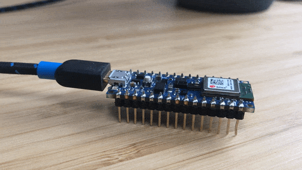

# Hello CASA

Simplified Arduino sketch that sets the brightness of the built in LED according to a model created in TensorFlow that mimics a Sine wave.
The sketch passes in an 'x' value in the range 0 - 2*PI and the model outputs a 'y' value. Use Tools/Serial plotter to view data.

To use your own model update the model.cc file.

