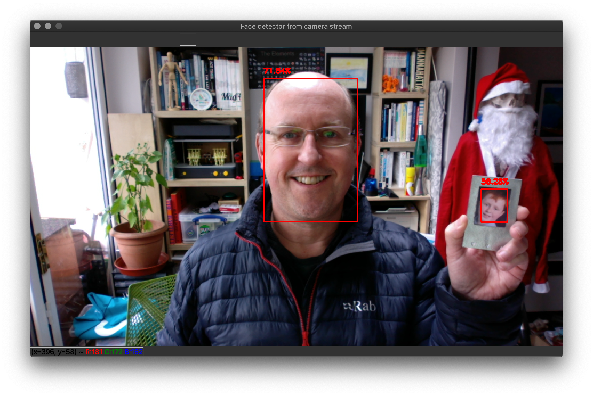

# Python Face Detector Examples

## Haar Cascade example
Also tracks eyes within the face.

## MobileNet SSD example
Example built into the OpenCV library - note proto file and Caffe pretrained model.

